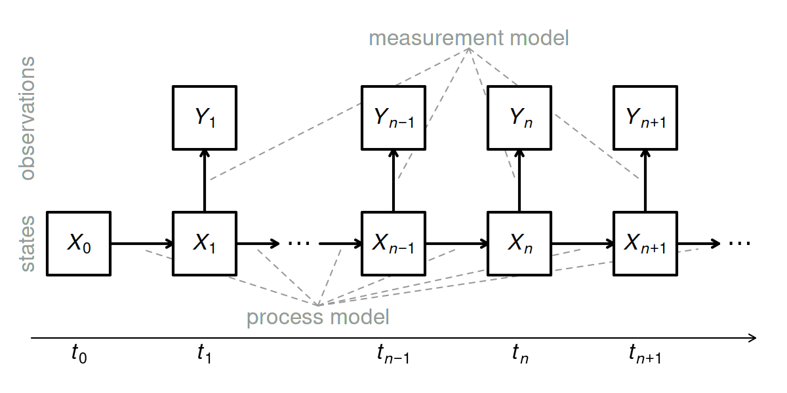

.](./assets/ptarmigan.jpg)

# Introduction

Studying ecology, especially animal population dynamics, is essential for understanding the complex interactions between species and their environment, guiding conservation efforts, and ensuring the sustainable use of natural resources for future generations.. By modeling population dynamics, researchers and scientists can understand how animals respond to environmental changes and human activities. This helps conservation efforts by identifying threatened species and develop strategies to protect biodiversity. Moreover, animal populations can serve as reservoirs for infectious diseases that can affect both human and animal health. Having a robust understanding of population movement can help predict disease outbreaks, understand transmission patterns, and improve disease control and prevention.

This report extends previous research investigating the long-term population decline of willow ptarmigan *Lagopus lagopus*. 

- The alternative prey hypothesis predicts that the interaction between generalist predators and their main prey is a major driver of population dynamics of alternative prey species.

- Grouse species are of the most studied

- In this report, we analyzed 142 years of data to investigate whether the population growth of a declining alternative prey species, the willow ptarmigan, is related to an interaction between red foxes and their main prey, small rodents.

## Related Work

## Data

Our data includes 142 observations of CPUE from 1872 to 2012. The harvest data was recorded by hunters in the Southeastern mountain regions of Norway. The data is provided by the authors of the study and is hosted by Dryad [here](). A description of the dataset provided by the authors is given below: 

- **year**: Self explanatory
- **CPUE**: Catch per unit effort, expressed as a number of birds shot per hunter per year.
- **log.CPUE**: Logarithm transformation of CPUE
- **peak_rodent_year**: Peak rodent year is scored as “yes”, otherwise “no”. Occurrence of peak
rodent years were extracted from four sources: 1871-1949 (Wildhagen 1952), 1932-1971
(Myrberget 1982a), 1971-1979 (Christiansen 1983), 1981-1985 (Frafjord 1988), 1986- 1989
(Selås et al. 2013), and 1990-2013 (Framstad 2017). Note that 1980 is missing as we were
not able to find an estimate for this year.

# Data Analysis

```{r libraries, echo=FALSE, message=FALSE}
library(readxl)
library(ggplot2)
library(knitr)
library(forecast)
library(dplyr)
library(cowplot)
library(pomp)
```


```{r data_table, echo=FALSE}
data <- read_excel("./data/bird_data.xlsx")
data |>
  rename(peak_rodent_year = "peak rodent year") -> data

knitr::kable(data[1:5, 1:6], caption = "Data")
```

```{r, echo=FALSE, message=FALSE}
# Most basic bubble plot
p1 <- ggplot(data, aes(x=year, y=CPUE)) +
  geom_line(color="steelblue") + 
  geom_point() + 
  geom_rect(
    data = subset(data, peak_rodent_year == 'yes'),
            aes(xmin = year - 0.5, xmax = year + 0.5, ymin = -Inf, ymax = Inf),
            fill = "blue", alpha = 0.3
    ) + 
  theme_light() +
  xlab("") + 
  stat_smooth(
    color = "#FC4E07",
    method = "loess"
  )

p2 <- ggplot(data, aes(x=year, y=log.CPUE)) + 
  geom_line(color="steelblue") + 
  geom_point() + 
  geom_rect(
    data = subset(data, peak_rodent_year == 'yes'),
            aes(xmin = year - 0.5, xmax = year + 0.5, ymin = -Inf, ymax = Inf),
            fill = "blue", alpha = 0.3
    ) + 
  theme_light() + 
  xlab("Year") + 
  stat_smooth(
    color = "#FC4E07",
    method = "loess"
  )

plot_grid(
  p1, p2,
  labels = "AUTO", 
  ncol = 1
)
```

Looking at both *CPUE* and *log.CPUE* in [figure], it's evident that ptarmigan populations has steadily decreased over the 142 year-long period. The blue shaded regions highlight years when peak rodent year is "yes." Notice how both plots exhibit peaks in the shaded regions and troughs otherwise, which is exactly what we expected to see from the alternative prey hypothesis. It's also worth noting that this trend is far less apparent beyond the early 1900s. 

In accordance with the previous study, our analysis will use *log.CPUE* to reduce heteroscedasticity.


```{r ACF, echo=FALSE}
acf(data$log.CPUE, lag = 100, main = "ACF log.CPUE")
```

```{r PACF, echo=FALSE}
pacf(data$log.CPUE, lag = 100, main = "PACF log.CPUE")
```

--------

# Methods

## ARMA Baseline

We will start off by fitting a simple ARMA model with parameters chosen using the algorithmic approach, grid search. This simple model will serve as a reference against which the performance of the more advanced POMP model is measured. Essentially, the ARMA model will serve as a yardstick for managing expectations. Of the models shown in (table #), we select the one with the Akaike’s information criterion (AIC). AIC is essentially “minus twice the maximized log likelihood plus twice the number of parameters [cite],” and is defined by:

$$AIC=-2\times\ell(\theta^*)+2D$$

```{r grid_search, echo=FALSE, warning=FALSE}
aic_table <- function(data,P,Q){
  table <- matrix(NA,(P+1),(Q+1))
  for(p in 0:P) {
    for(q in 0:Q) {
      table[p+1,q+1] <- arima(data,order=c(p,0,q))$aic
    }
  }
  dimnames(table) <- list(paste("AR",0:P, sep=""),
    paste("MA",0:Q,sep=""))
  table
}

bird_aic_table <- aic_table(data$log.CPUE,4,5)
require(knitr)
kable(bird_aic_table,digits=2)
```


## Partially Observed Markov Process

Partially observed Markov process models, also known as state-space models, hidden Markov models, and stochastic dynamical system models "consist of an unobserved Markov state process, connected to the data via an explicit model of the observation process." The former is referred to as the *latent process model* and the latter as the *measurement model.*



### Ricker Model

```{r}

```


--------

## Diagnostics

--------

# Results 

--------

# Conclusion

--------

# References